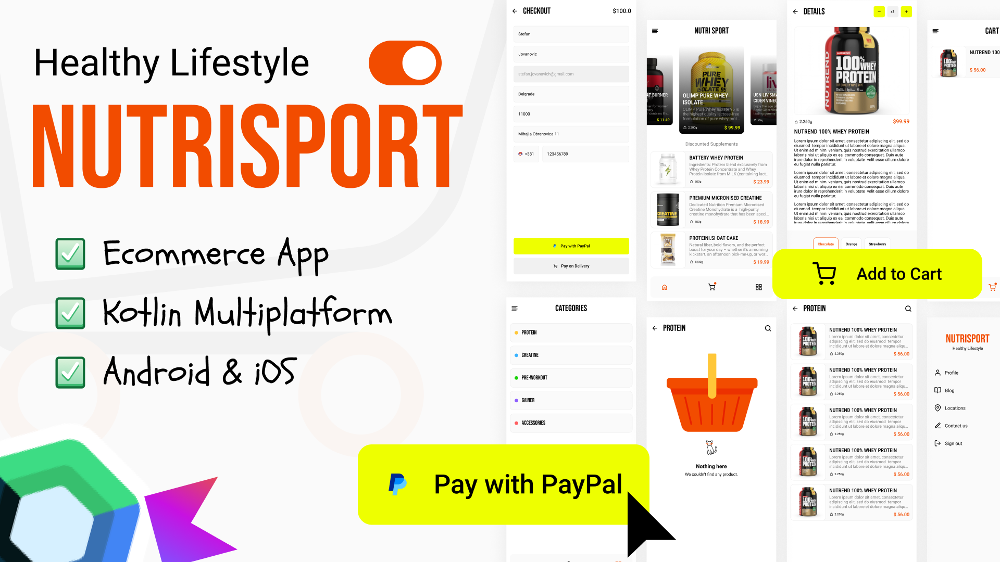

# 🍕 Naruči Klopu - Food Ordering Mobile App

<div align="center">


**Cross-platform food ordering app built with Kotlin Multiplatform and Jetpack Compose**

[Download APK](https://github.com/GSicanica/naruciKlopu/releases) • [Backend API](https://github.com/GSicanica/admin-symfony) • [Report Bug](https://github.com/GSicanica/naruciKlopu/issues)

</div>

---

## 📱 Screenshots

<div align="center">

</div>

---

## ✨ Features

| Feature | Description |
|---------|-------------|
| 🏪 **Restaurant Discovery** | Browse restaurants with categories and search |
| 🍔 **Product Catalog** | View products with images, prices, and flavors |
| 🛒 **Shopping Cart** | Add items, adjust quantities, select flavors |
| 📦 **Order Management** | Place orders and track status |
| 👤 **User Profile** | Manage account and delivery addresses |
| 🔐 **Authentication** | Email/password + Google OAuth login |
| 📍 **Multiple Locations** | Save and manage delivery addresses |
| 💳 **Checkout** | Streamlined order placement |
| 📊 **Admin Panel** | Manage products and view analytics (admin users) |

---

## 🛠 Tech Stack

| Technology | Purpose |
|------------|---------|
| **Kotlin 2.0** | Programming language |
| **Compose Multiplatform** | Cross-platform UI framework |
| **Ktor** | HTTP client for API calls |
| **Koin** | Dependency injection |
| **Coil 3** | Image loading and caching |
| **Kotlinx Serialization** | JSON parsing |
| **Navigation Compose** | Type-safe navigation |
| **Coroutines + Flow** | Async operations |

---

## 📁 Project Structure

```
naruciklpi/
├── 📂 composeApp/              # Main application module
│   ├── src/androidMain/        # Android-specific code
│   ├── src/iosMain/            # iOS-specific code
│   └── src/commonMain/         # Shared app entry point
├── 📂 shared/                  # Shared UI and domain
│   ├── component/              # Reusable UI components
│   ├── domain/                 # Domain models
│   ├── fonts/                  # Theme (colors, typography)
│   └── navigation/             # Screen definitions
├── 📂 data/                    # Data layer
│   ├── remote/                 # API services and HTTP client
│   ├── domain/                 # Repository interfaces
│   └── usecase/                # Business logic use cases
├── 📂 di/                      # Dependency injection modules
├── 📂 navigation/              # Navigation graph
└── 📂 feature/                 # Feature modules
    ├── auth/                   # Login & registration
    ├── home/                   # Main screen with bottom nav
    │   ├── categories/         # Category browsing
    │   ├── products_overview/  # Product listing
    │   └── cart/               # Shopping cart & checkout
    ├── details/                # Product details
    ├── profile/                # User profile
    ├── locations/              # Delivery addresses
    ├── admin_panel/            # Admin dashboard
    └── payment_completed/      # Order confirmation
```

---

## 🚀 Getting Started

### Prerequisites

- Android Studio Hedgehog or newer
- JDK 17+
- Kotlin 2.0+
- Xcode 15+ (for iOS)

### Build & Run

```bash
# Clone repository
git clone https://github.com/GSicanica/naruciKlopu.git
cd naruciKlopu

# Build Android debug APK
./gradlew :composeApp:assembleDebug

# Install on connected device
./gradlew :composeApp:installDebug

# Build release bundle (Play Store)
./gradlew :composeApp:bundleRelease
```

### iOS Build

```bash
# Open in Xcode
open iosApp/iosApp.xcodeproj

# Or build from command line
./gradlew :composeApp:linkDebugFrameworkIosSimulatorArm64
```

---

## 🔧 Configuration

### API Configuration

Update the API base URL in `data/src/commonMain/kotlin/.../ApiConfig.kt`:

```kotlin
object ApiConfig {
    const val BASE_URL = "https://your-api-domain.com/api"
}
```

### Firebase Setup

1. Add your `google-services.json` to `composeApp/`
2. Add your `GoogleService-Info.plist` to `iosApp/iosApp/`

---

## 🌐 Backend API

This app connects to the **AppBosna Symfony Backend**:
- Repository: [admin-symfony](https://github.com/GSicanica/admin-symfony)
- API Docs: `https://your-domain.com/api/docs`

### Key Endpoints

| Endpoint | Description |
|----------|-------------|
| `POST /api/auth/login` | User authentication |
| `GET /api/products` | List products |
| `GET /api/categories` | List categories |
| `GET /api/restaurants` | List restaurants |
| `POST /api/orders` | Create order |
| `GET /api/cart` | Get user cart |

---

## 📦 Modules

| Module | Description |
|--------|-------------|
| `composeApp` | Main Android/iOS application |
| `shared` | Common UI components and domain models |
| `data` | Repository implementations and API services |
| `di` | Koin dependency injection setup |
| `navigation` | Navigation graph and routes |
| `feature:auth` | Authentication screens |
| `feature:home` | Main home with categories/products |
| `feature:details` | Product detail screen |
| `feature:profile` | User profile management |
| `feature:locations` | Delivery address management |
| `feature:admin_panel` | Admin dashboard (admin users) |

---

## 🔐 Authentication Flow

```
┌─────────────┐     ┌─────────────┐     ┌─────────────┐
│  AuthScreen │────▶│  API Login  │────▶│ Store Token │
└─────────────┘     └─────────────┘     └─────────────┘
                           │
                           ▼
                    ┌─────────────┐
                    │  HomeScreen │
                    └─────────────┘
```

Tokens are stored securely using:
- Android: EncryptedSharedPreferences
- iOS: Keychain

---

## 🏗 Architecture

The app follows **Clean Architecture** with **MVVM**:

```
┌───────────────────────────────────────────┐
│                  UI Layer                  │
│  (Compose Screens + ViewModels)           │
├───────────────────────────────────────────┤
│               Domain Layer                 │
│  (Use Cases + Repository Interfaces)      │
├───────────────────────────────────────────┤
│                Data Layer                  │
│  (Repository Impl + API Services)         │
└───────────────────────────────────────────┘
```

---

## 🧪 Building for Production

### Android Release

```bash
# Create signed bundle
./gradlew :composeApp:bundleRelease

# Output: composeApp/build/outputs/bundle/release/composeApp-release.aab
```

### iOS Release

1. Open `iosApp/iosApp.xcodeproj` in Xcode
2. Select "Any iOS Device" target
3. Product → Archive
4. Distribute to App Store

---

## 📄 License

```
MIT License

Copyright (c) 2024-2026 AppBosna

Permission is hereby granted, free of charge, to any person obtaining a copy
of this software...
```

---

<div align="center">

**Built with ❤️ in Bosnia**

[⬆ Back to Top](#-naruči-klopu---food-ordering-mobile-app)

</div>
